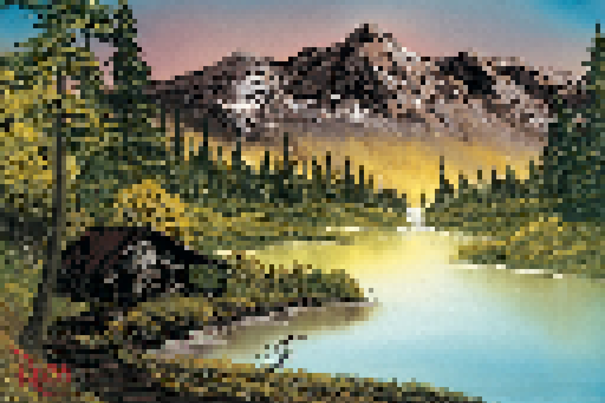
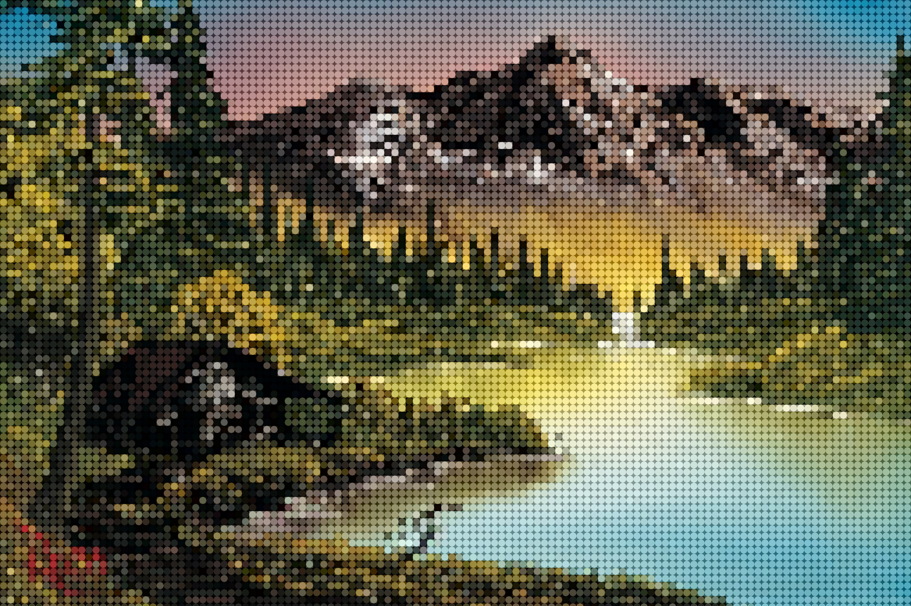

# Pixelator

**Written in p5.js, creates pixelated images / videos.**

### To Run:

1. Set up a [local server](https://github.com/processing/p5.js/wiki/Local-server), hosting the whole folder
2. under `sketch.js`, rename the `load` variable to the path to image/mp4 file, e.g `images/helloWorld.jpg` (to-do: make this easy to do with drag-and-drop)
3. execute hosted webpage
4. ??
5. enjoy!

### Current Functionality:

- Can accept any major image / video file
- Can toggle between square/circular pixels with the `1` key
- Pixel size can be changed with `,` and `.` keys (< or >)
- mute with `m`, and pause with `p` (only applies to video files)
- Save image (jpg) with the space key

### Examples:

**Square pixels:**

**Circular Pixels:**

### To-Do:

- Add drag-and-drop functionality on the index page
- allow videos to be captured and saved
